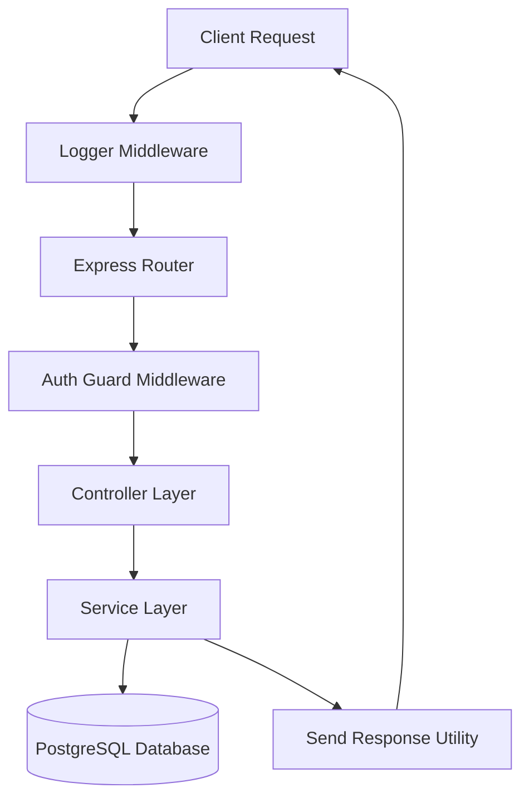
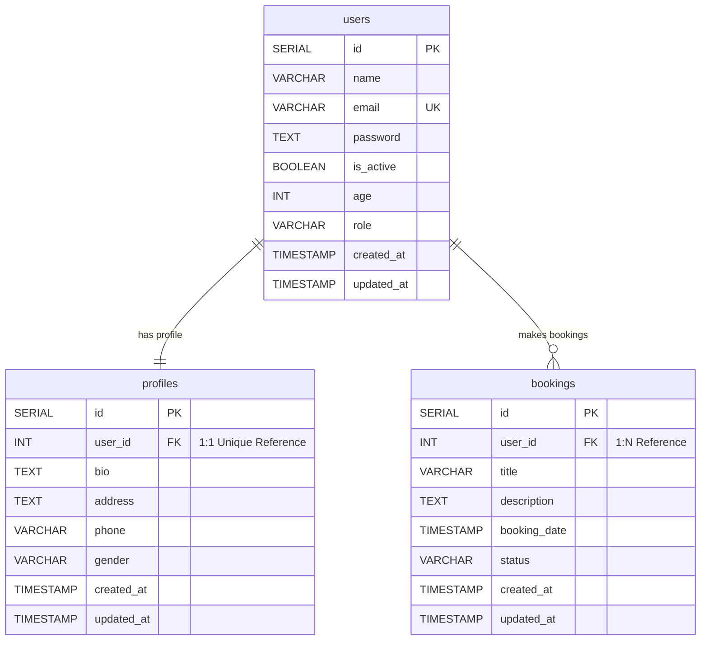

# Express & TypeScript Backend API Server

একটি প্রফেশনাল, স্কেলেবল এবং টাইপ-সেফ Express.js ব্যাকএন্ড অ্যাপ্লিকেশন যা TypeScript এবং PostgreSQL (Neon Serverless DB) দ্বারা চালিত। এই প্রজেক্টে মডিউলার আর্কিটেকচার (Layered Architecture) অনুসরণ করে Auth, User, Profile এবং Booking ফিচারগুলো তৈরি করা হয়েছে।

---

## ১. প্রজেক্টের বৈশিষ্ট্য (Key Features)
- **TypeScript Integration:** সম্পূর্ণ টাইপ-সেফ ডেভেলপমেন্ট এনভায়রনমেন্ট।
- **Relational Database Schema:** `users`, `profiles`, এবং `bookings` টেবিলের মধ্যে সম্পর্কযুক্ত ডেটাবেস ডিজাইন।
- **JWT Authentication & Authorization:** `accessToken` এবং `refreshToken` ভিত্তিক অথেন্টিকেশন।
- **Role-Based Access Control (RBAC):** `admin`, `agent`, এবং `user` রোলের ভিত্তিতে রাউট সিকিউরিটি।
- **Modular Architecture:** প্রতিটা ফিচারের জন্য কন্ট্রোলার, সার্ভিস, রাউট এবং ইন্টারফেস আলাদা মডিউলে বিভক্ত।
- **Custom Logging Middleware:** প্রতিটা রিকোয়েস্ট ডিটেইলস স্বয়ংক্রিয়ভাবে `logger.txt` ফাইলে স্টোর করা।
- **Global Error Handler:** সেন্ট্রাল এরর হ্যান্ডেলিং মেকানিজম।

---

## ২. প্রজেক্ট আর্কিটেকচার (Project Architecture)

নিচে অ্যাপ্লিকেশনের রিকোয়েস্ট ফ্লো দেখানো হলো:



---

## ৩. ডিরেক্টরি স্ট্রাকচার (Directory Structure)

```text
express-typescript/
├── src/
│   ├── app.ts                  # এক্সপ্রেস অ্যাপ ইনিশিয়ালাইজেশন এবং মিডলওয়্যার রেজিস্ট্রেশন
│   ├── server.ts               # ডেটাবেস কানেক্ট এবং সার্ভার লিসেন পোর্ট সেটআপ
│   ├── index.ts                # ব্যাকআপ এন্ট্রি ফাইল
│   ├── config/
│   │   └── index.ts            # .env ভেরিয়েবল কনফিগারেশন
│   ├── db/
│   │   └── index.ts            # pg Pool কানেকশন এবং টেবিল ইনিশিয়ালাইজেশন স্ক্রিপ্ট
│   ├── middleware/
│   │   ├── auth.ts             # JWT এবং Role-Based অথরাইজেশন মিডলওয়্যার
│   │   ├── globalErrorHandler.ts # গ্লোবাল এরর হ্যান্ডেলার
│   │   └── logger.ts           # রিকোয়েস্ট লগ লেখার মিডলওয়্যার
│   ├── modules/
│   │   ├── auth/               # লগইন এবং রিফ্রেশ টোকেন মডিউল
│   │   ├── user/               # ইউজার ম্যানেজমেন্ট মডিউল
│   │   ├── profile/            # ইউজার প্রোফাইল মডিউল
│   │   └── booking/            # বুকিং ম্যানেজমেন্ট মডিউল
│   ├── types/
│   │   ├── index.ts            # ইউজার রোল টাইপস
│   │   └── index.d.ts          # এক্সপ্রেস রিকোয়েস্টে কাস্টম টাইপ এক্সটেনশন
│   └── utility/
│       └── sendResponse.ts     # রেসপন্স ফরম্যাটার ফাংশন
├── .env                        # এনভায়রনমেন্ট কনফিগারেশন ফাইল
├── tsconfig.json               # টাইপস্ক্রিপ্ট কম্পাইলার কনফিগারেশন
├── package.json                # ডিপেন্ডেন্সি এবং স্ক্রিপ্ট লিস্ট
└── readme.md                   # প্রজেক্ট ডকুমেন্টেশন
```

---

## ৪. ডেটাবেস স্কিমা (Database Schema & Relationships)

প্রজেক্টে ৩টি টেবিল রয়েছে যাদের রিলেশনশিপ নিচে দেখানো হলো:
1. **users** – মূল ইউজার ইনফরমেশন।
2. **profiles** – ইউজারের ওয়ান-টু-ওয়ান (`1:1`) রিলেশন প্রোফাইল ইনফো (User ডিলিট হলে Profile ডিলিট হবে)।
3. **bookings** – ইউজারের ওয়ান-টু-মেনি (`1:N`) রিলেশন বুকিং ডাটা।



---

## ৫. এপিআই ডকুমেন্টেশন (API Documentation)

### Auth এপিআই (`/api/auth`)
| Method | Endpoint | Description | Headers / Cookies |
| :--- | :--- | :--- | :--- |
| **POST** | `/signup` | নতুন ইউজার রেজিস্টার করতে | None |
| **POST** | `/login` | লগইন করতে (অ্যাক্সেস টোকেন এবং রিফ্রেশ টোকেন রিটার্ন করে) | Sets `refreshToken` cookie |
| **POST** | `/refresh-token` | নতুন অ্যাক্সেস টোকেন জেনারেট করতে | `refreshToken` cookie/body |

### User এপিআই (`/api/users`)
| Method | Endpoint | Description | Role Access |
| :--- | :--- | :--- | :--- |
| **POST** | `/` | ইউজার তৈরি করতে (Signup সমতুল্য) | Public |
| **GET** | `/` | সব ইউজারের তথ্য দেখতে | `admin`, `agent`, `user` |
| **GET** | `/:id` | নির্দিষ্ট কোনো ইউজারের তথ্য দেখতে | Public |
| **PUT** | `/:id` | ইউজারের তথ্য আপডেট করতে | Public |
| **DELETE** | `/:id` | ইউজার ডিলিট করতে | Public |

### Profile এপিআই (`/api/profile`)
| Method | Endpoint | Description | Role Access |
| :--- | :--- | :--- | :--- |
| **POST** | `/` | নতুন প্রোফাইল তৈরি করতে | Public |
| **GET** | `/` | সব ইউজারের প্রোফাইল দেখতে | Public |
| **GET** | `/:id` | নির্দিষ্ট প্রোফাইল আইডি অনুযায়ী তথ্য দেখতে | Public |
| **PUT** | `/:id` | প্রোফাইল আপডেট করতে | Public |
| **DELETE** | `/:id` | প্রোফাইল মুছে ফেলতে | Public |

### Booking এপিআই (`/api/bookings`)
*নোট: বুকিং রাউটগুলো সুরক্ষিত। রিকোয়েস্ট হেডারে `Authorization` ফিল্ডে JWT অ্যাক্সেস টোকেন পাঠানো আবশ্যক।*

| Method | Endpoint | Description | Role Access | Logic Constraints |
| :--- | :--- | :--- | :--- | :--- |
| **POST** | `/` | নতুন বুকিং তৈরি করতে | `admin`, `agent`, `user` | `user` রোল শুধুমাত্র নিজের জন্যই বুক করতে পারে। |
| **GET** | `/` | সব বুকিং দেখতে | `admin`, `agent`, `user` | `user` রোল শুধু নিজের এবং `admin/agent` রোল সবার বুকিং দেখে। |
| **GET** | `/:id` | নির্দিষ্ট বুকিং আইডি দেখতে | `admin`, `agent`, `user` | `user` রোল হলে বুকিংয়ের মালিকানা চেক করা হয়। |
| **PUT** | `/:id` | বুকিং তথ্য আপডেট করতে | `admin`, `agent`, `user` | `user` রোল শুধু বুকিং ক্যানসেল করতে পারবে, স্ট্যাটাস পরিবর্তন করতে পারবে না। |
| **DELETE** | `/:id` | বুকিং বাতিল/মুছে ফেলতে | `admin`, `agent`, `user` | `user` রোল নিজের বুকিং ডিলিট করতে পারে। |

---

## ৬. প্রজেক্ট রান করার নির্দেশিকা (Setup & Running)

### পরিবেশ সেটআপ (Environment Setup)
রুট ডিরেক্টরিতে একটি `.env` ফাইল তৈরি করুন এবং নিচের মানগুলো দিন:
```env
DATABASE_URL=your_postgresql_connection_string
PORT=5000
JWT_SECRET=your_jwt_secret_key
JWT_REFRESH_SECRET=your_jwt_refresh_secret_key
```

### ডিপেন্ডেন্সি ইনস্টল (Install Dependencies)
```bash
npm install
```

### লোকাল ডেভেলপমেন্ট সার্ভার চালু করা (Run Local Server)
ডেভেলপমেন্টে সার্ভার চালাতে `tsx watch` ব্যবহার করা হয় যা কোড এডিট করার সাথে সাথে সার্ভার রিস্টার্ট নেয়।
```bash
npm run dev
```

### প্রোডাকশন বিল্ড এবং স্টার্ট (Build & Run Production)
```bash
npm run build
npm start
```

---

## ৭. গুরুত্বপূর্ণ কনফিগারেশন ফাইলসমূহ

- **[tsconfig.json](file:///f:/express-Typescript/tsconfig.json):** টাইপস্ক্রিপ্ট কনফিগারেশন যা আউটপুট ডিরেক্টরি `dist` এ আউটপুট ম্যাপিং ও ইএস মডিউল টার্গেট হ্যান্ডেল করে।
- **[tsup.config.ts](file:///f:/express-Typescript/tsup.config.ts):** বান্ডলার কনফিগারেশন ফাইল যা কোডকে সহজে বান্ডেল করার জন্য ব্যবহৃত হয়।
- **[vercel.json](file:///f:/express-Typescript/vercel.json):** Vercel প্ল্যাটফর্মে ডেপ্লয় করার রাউটিং এবং বিল্ড ডিরেকশন কনফিগারেশন।

---

## ৮. ভবিষ্যৎ উন্নয়নের জন্য পরামর্শ (Suggested Enhancements)
১. **Input Validation (Zod/Joi):** API ইনপুট ডাটা সুরক্ষিত রাখতে Zod বা Joi স্কিমা ভ্যালিডেশন যুক্ত করা উচিত।
২. **Database Migration Tool (Kysely/Prisma/Drizzle):** Raw SQL কুয়েরি রান করার পরিবর্তে টাইপ-সেফ কোয়েরি বিল্ডার বা ORM ব্যবহার করলে ডাটাবেস হ্যান্ডলিং আরও সহজ হবে।
৩. **TypeScript Absolute Paths:** `../../` রিলেটিভ ইম্পোর্টের পরিবর্তে `@/middleware` এর মতো অ্যাবসল্যুট ইম্পোর্ট কনফিগার করা দরকার।
৪. **Unit Testing:** `Jest` বা `Vitest` ব্যবহার করে কন্ট্রোলার এবং সার্ভিসগুলোর জন্য ইউনিট টেস্ট যুক্ত করা যেতে পারে।